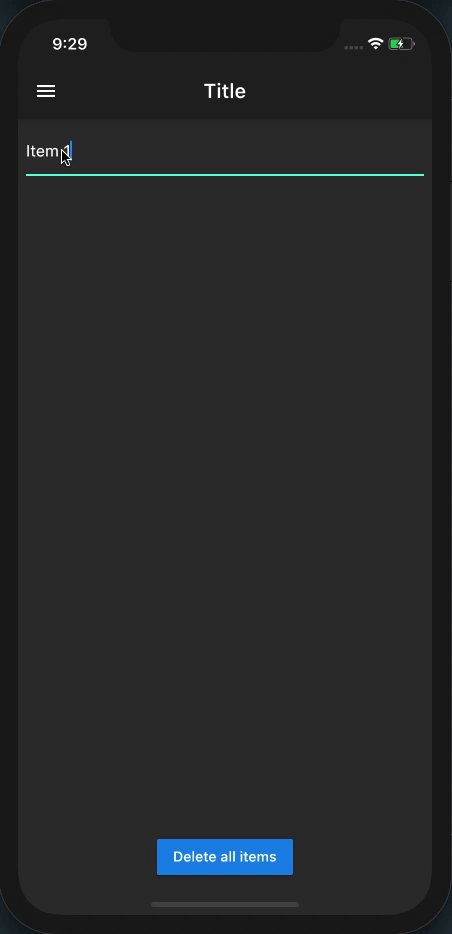

# Flutter To Do App with Redux State Management

This app is used as an intro to redux state management

### Functionalities :

- Tasks creation / deletion
- Data persistence with SharedPreferences
- Redux Time Travel

## Demo

